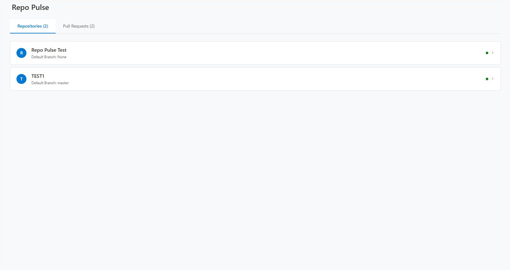

# RepoPulse Extension

A modern Azure DevOps extension that provides enhanced repository and pull request management capabilities with an intuitive React-based interface. RepoPulse streamlines your development workflow by offering a comprehensive dashboard for monitoring repositories and managing pull requests across your Azure DevOps projects.

## Features

- **Repository Dashboard**: View all repositories in your project with detailed information including default branches and repository sizes
- **Pull Request Management**: Monitor active pull requests grouped by title for better organization
- **Automated PR Creation**: Create update pull requests from master branch to feature branches with a single click
- **Cross-Repository Support**: Manage multiple repositories from a single unified interface
- **Real-time Status Updates**: Get instant feedback through toast notifications for all operations
- **Modern UI**: Clean, responsive interface built with React and Azure DevOps UI components
- **Smart URL Detection**: Automatically detects Azure DevOps base URL for on-premises and cloud deployments

## Installation

1. Navigate to the [Azure DevOps Marketplace](https://marketplace.visualstudio.com/azuredevops)
2. Search for "RepoPulse" or "Repo Pulse"
3. Click **Get it free** to install the extension
4. Select your Azure DevOps organization
5. Confirm the installation and required permissions

Once installed, you'll find RepoPulse in the **Repos** section of your Azure DevOps project navigation.

## Usage

1. Navigate to any Azure DevOps project where the extension is installed
2. Click on **Repos** in the main navigation
3. Select **Repo Pulse** from the hub menu
4. Use the tabs to switch between:
   - **Repositories**: View and manage all project repositories
   - **Pull Requests**: Monitor and manage active pull requests

## Screenshots

### Repository Dashboard

*View all repositories with detailed information and quick access links*

### Pull Request Management

*Monitor active pull requests grouped by title with automated update capabilities*

### Extension in Azure DevOps Navigation

*RepoPulse integrated seamlessly into Azure DevOps navigation*

## Requirements

- Azure DevOps Services or Azure DevOps Server 2019 or later
- Repository read/write permissions
- Pull request management permissions

## Support

For issues, feature requests, or questions:
- Create an issue in the extension's repository
- Contact the publisher through the Azure DevOps Marketplace

## License

This extension is provided under the MIT License.
